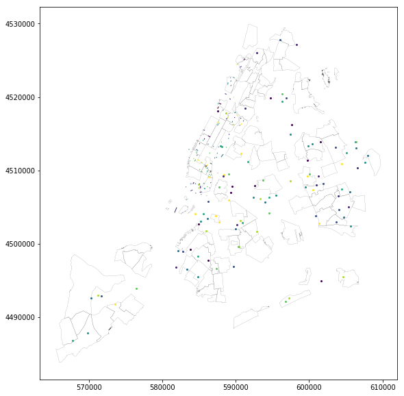

#  let's make sure you've got the datasets

here we are basically dealing with shapefiles (.shp). It helps us a lot to load geometry data since data is stored with spatial index and divided in multiple files. We dont need to know what it exactly is, but you can check it out later:

https://en.wikipedia.org/wiki/Shapefile


## Shapefiles should be at the folder project/data. Here it goes the urls we need:

trees:
https://data.cityofnewyork.us/Environment/2015-Street-Tree-Census-Tree-Data/pi5s-9p35/data

neighbourhoods:
https://www1.nyc.gov/assets/planning/download/zip/data-maps/open-data/nynta_17a.zip

streets base lines:
https://data.cityofnewyork.us/City-Government/NYC-Street-Centerline-CSCL-/exjm-f27b/data


## some tricks to make it easier to reload the modules while coding


```python
%load_ext autoreload
%autoreload 2
%matplotlib inline
```

## loading base modules 


```python
import geopandas as gpd
import pandas as pd
import fiona
from shapely.geometry import Point, MultiLineString, LineString, Polygon, box
import matplotlib.pyplot as plt
plt.rcParams["figure.figsize"] = [10,10]
```

## loading the datasets (takes a while to load at the first time..)


```python
from functools import partial
import pyproj
from shapely.ops import transform
villagesdf = gpd.GeoDataFrame.from_file('data/nynta_17a/nynta.shp')
streets = gpd.read_file('data/cscl/geo_export_7db5438d-c515-499f-9d51-39f981ba8501.shp', driver='ESRI Shapefile')
trees = gpd.read_file('data/trees/geo_export_f822eeee-0176-4586-ada0-7a06ce492b84.shp', driver='ESRI Shapefile')
```

## converting CRS to UTM ( "flat" the maps, thus spatial queries get much easier)


```python
villagesdf = villagesdf.to_crs(epsg=26918)
streets = streets.to_crs(epsg=26918)
trees = trees.to_crs(epsg=26918)

```

## let's constraint our working data to Manhattan only


```python
villagesmn = villagesdf[villagesdf.BoroCode==1]
streetsmn = streets[streets.borocode=='1']
treesmn = trees[trees.borocode=='1']
```


### as an example, let's quick sample the entire datasets thus the plot runs faster for now


```python
fig, ax = plt.subplots()
ax.set_aspect('equal')
villagesdf.sample(100).plot(ax=ax, color="white", linewidth=.1)
trees.sample(100).plot(ax=ax)
streetsmn.sample(100).plot(ax=ax)
```


    <matplotlib.axes._subplots.AxesSubplot at 0x7f0024ac4450>




# plotting trees and streets in MN borough 

## let's aggregate the number of trees by neighbourhoods

### .. to be continued 


```python

```
